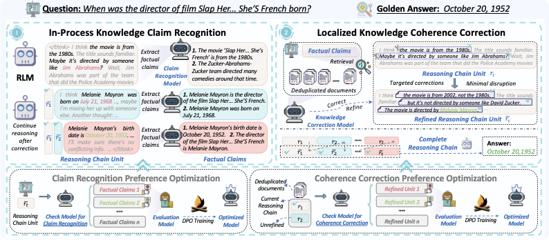

<div align="center">
<h1> CheckRLM: Effective Knowledge-Thought Coherence Checking in
Retrieval-Augmented Reasoning
<h5 align="center"> 

<a href='https://aclanthology.org/2026.acl-long.1780/'></a>
<a href='https://huggingface.co/datasets/ldbb123/CheckRLM_DPO_Training_Qwen2.5-14B'></a>
<a href='https://huggingface.co/ldbb123/CheckRLM_Qwen-2.5-14B_DPO'></a>


Dingling Xu<sup>1</sup>,
Ruobing Wang<sup>2</sup>,
Qingfei Zhao<sup>2</sup>,
Yukun Yan<sup>3</sup>,
Zhichun Wang<sup>1</sup>,
Daren Zha<sup>2</sup>,
Shi Yu<sup>3</sup>,
Zhenghao Liu<sup>4</sup>,
Shuo Wang<sup>3</sup>,
Xu Han<sup>3</sup>,
Maosong Sun<sup>3</sup>

<sup>1</sup>Beijing Normal University, <sup>2</sup>
Institute of Information Engineering, Chinese Academy of Sciences, <sup>3</sup>Tsinghua University, <sup>4</sup>Northeastern University

</h5>
</div>


## 📖 Introduction


We propose **CheckRLM**, a framework that employs Retrieval-Augmented Generation (RAG) to promptly identify and correct factual errors within long reasoning chains, thereby aligning them with external knowledge. CheckRLM comprises two components: in-process knowledge claim recognition and localized knowledge coherence correction via retrieval. 

<p align="center"></p>


## ⚙️ Installation

### Environment Setup

```bash
conda create --name checkrlm python=3.12
conda activate checkrlm

git clone https://github.com/AI9Stars/CheckRLM.git
cd CheckRLM
pip install -r requirement.txt
```

### Elasticsearch Setup

Install Elasticsearch for BM25 retrieval:

```bash
wget https://artifacts.elastic.co/downloads/elasticsearch/elasticsearch-7.10.2-linux-x86_64.tar.gz
wget https://artifacts.elastic.co/downloads/elasticsearch/elasticsearch-7.10.2-linux-x86_64.tar.gz.sha512
shasum -a 512 -c elasticsearch-7.10.2-linux-x86_64.tar.gz.sha512
tar -xzf elasticsearch-7.10.2-linux-x86_64.tar.gz
cd elasticsearch-7.10.2/
./bin/elasticsearch # Start the server
pkill -f elasticsearch # To stop the server
```

## 📁 Dataset Preparation

We evaluate on five benchmarks: `hotpotqa`, `2wikimultihopqa`, `simpleqa`, `musique`, and `iirc`. For `hotpotqa`, `2wikimultihopqa`, `musique`, and `iirc`, the evaluation splits and retrieval corpora follow the [IRCoT](https://github.com/StonyBrookNLP/ircot) setup. For `simpleqa`, we randomly sample 500 instances from the official test set and retrieve against the [KILT](https://github.com/facebookresearch/KILT) Wikipedia knowledge source.

All per-benchmark files are under `data/{dataset_name}/`, with subsampled questions in `data/{dataset_name}/test_subsampled.jsonl`.

To fetch retrieval corpora, run the following from the repository root (the script follows IRCoT-style sources and may install helpers such as `gdown`):

```bash
cd CheckRLM
bash src/download_corpus.sh
```

## 🛠️ Configuration
You can configure Project root, Dataset Parameters, Model Parameters, Retrieval Parameters and DPO Parameters in `src/scripts/config.sh`.

## 💾 Build Indices
For `hotpotqa`, `2wikimultihopqa`, `musique`, and `iirc`:

- BM25 retrieval based on Elasticsearch
- Dense retrieval with FAISS index using embeddings from bge-large-en-v1.5

For `simpleqa`:

Dense retrieval with FAISS index using embeddings from bge-large-en-v1.5

### BM25

```bash
cd src/scripts
bash run_build_index_bm25.sh
```

### Dense Retrieval

```bash
cd src/scripts
bash run_build_index_embedding.sh
```

## CheckRLM Inference

We implement four methods from the paper: **Direct Reasoning**, **Vanilla RAG**, **Post-reasoning Check**, and **In-reasoning Check**. **In-reasoning Check** achieves the strongest results in our experiments.

### Decoding hyperparameters

Configure the reasoning and check models under `src/config/reasoning_model.yaml` and `src/config/check_model.yaml` respectively. The parameters of different reasoning models and check models in the experiments are as follows:

| Reasoning backbone(s) | Temperature | top_p | top_k |
| ----------------------- | ----------- | ----- | ----- |
| Qwen3-8B, Qwen3-32B | 0.7 | 0.8 | 20 |
| QwQ-32B | 0.6 | 0.95 | 40 |
| DeepSeek-R1-Distill-Llama-70B | 0.6 | 0.95 | −1 |

| Check backbone(s) | Temperature | top_p | top_k |
| ----------------- | ----------- | ----- | ----- |
| Qwen3-8B | 0.7 | 0.8 | 20 |
| Qwen2.5-14B-Instruct, Qwen2.5-32B-Instruct, Llama-3.3-70B-Instruct | 0 | 0.95 | −1 |

### Direct Reasoning

```bash
bash src/scripts/run_base.sh
```

### Vanilla RAG

```bash
bash src/scripts/run_vanilla.sh
```

### Post-reasoning Check
```bash
bash src/scripts/run_check_think_offline.sh
```

### In-reasoning Check
```bash
bash src/scripts/run_check_think_online.sh
```

## DPO Training (Optional)
### Training Data Construction
Before running the data-construction scripts, edit `src/config/check_model.yaml` and set `temperature` and `top_p` to **lists** of numeric values.

```bash
bash src/scripts/gen_dpo_data.sh
```

### Training

```bash
bash src/scripts/train_dpo.sh
```

We also provide our [DPO training data](https://huggingface.co/datasets/ldbb123/CheckRLM_DPO_Training_Qwen2.5-14B) and [Qwen-2.5-14B-Instruct_DPO](https://huggingface.co/ldbb123/CheckRLM_Qwen-2.5-14B_DPO) model. 

## 📄 Acknowledgement

We acknowledge the following open-source projects that informed our code:

- [IRCOT](https://github.com/StonyBrookNLP/ircot)
- [DeepNote](https://github.com/thunlp/DeepNote)

## 🥰 Citation
```
@inproceedings{xu-etal-2026-checkrlm,
    title = "{C}heck{RLM}: Effective Knowledge{--}Thought Coherence Checking in Retrieval-Augmented Reasoning",
    author = "Xu, Dingling  and
      Wang, Ruobing  and
      Zhao, Qingfei  and
      Yan, Yukun  and
      Wang, Zhichun  and
      Zha, Daren  and
      Yu, Shi  and
      Liu, Zhenghao  and
      Wang, Shuo  and
      Han, Xu  and
      Sun, Maosong",
    editor = "Liakata, Maria  and
      Moreira, Viviane P.  and
      Zhang, Jiajun  and
      Jurgens, David",
    booktitle = "Proceedings of the 64th Annual Meeting of the {A}ssociation for {C}omputational {L}inguistics (Volume 1: Long Papers)",
    month = jul,
    year = "2026",
    address = "San Diego, California, United States",
    publisher = "Association for Computational Linguistics",
    url = "https://aclanthology.org/2026.acl-long.1780/",
    doi = "10.18653/v1/2026.acl-long.1780",
    pages = "38403--38426",
    ISBN = "979-8-89176-390-6",
    abstract = "Reasoning Language Models (RLMs) have significantly improved performance on complex tasks by extending the reasoning chain. However, these chains are prone to containing factual errors, particularly in knowledge-intensive tasks. To address this issue, we propose **CheckRLM**, a framework that improves the reliability of the reasoning process through Retrieval-Augmented Generation (RAG) by timely checking and correcting factual errors. Specifically, CheckRLM extracts factual claims from the reasoning chain to identify and localize subtle knowledge inconsistencies during inference. Upon detection of errors, a refinement mechanism performs minimal-cost yet precise corrections by leveraging external knowledge, ensuring coherence between the reasoning chain and correct knowledge. Extensive experiments demonstrate that CheckRLM substantially outperforms existing baselines, exhibiting a strong capability to mitigate error accumulation in long-horizon reasoning with lower costs. The code and data are available at https://github.com/AI9Stars/CheckRLM."
}
```

## ⭐ Star History
[](https://star-history.com/#AI9Stars/CheckRLM&Date)